# 1000 ~~100~~ Days Of Code - Log

`Write Record Descending date order`

## Day 43: Dec 17, 2020

#### Today's Progress

Learn Design Patterns by using JavaScript codes.

- 2-4
	- Singleton Pattern	

#### Thoughts

I often forget constructor functions...

#### Link to work

- [PR: Refactored Revealing Module Pattern and deepen learned](https://github.com/kk0917/javascript-design-patterns/pull/35)

#### Statistics - WakaTime

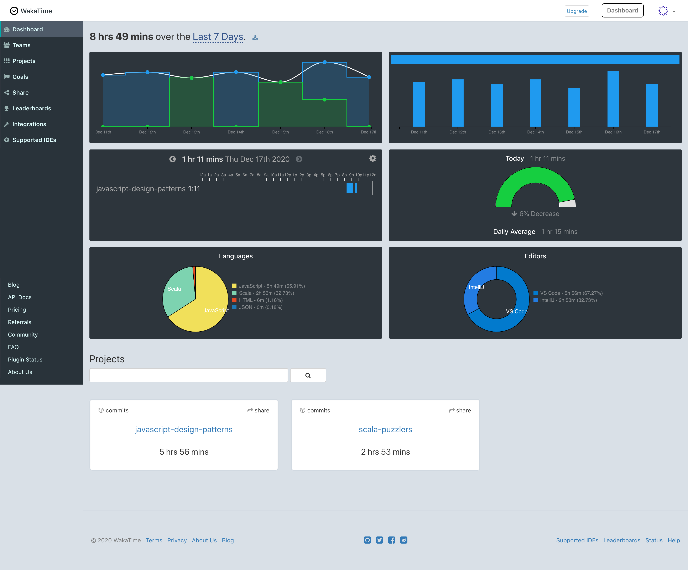

## Day 42: Dec 16, 2020

#### Today's Progress

Learn Scala Puzzles

- Puzzle 13
	- Refer self by self

Learn Design patterns by using JavaScript codes.

- 2-3
	- Revealing Module Pattern	

#### Thoughts

can Learned deeply by writing codes and execute its codes. Both are necessery, the one of both is not enough.

#### Link to work

- [PR: Learned the reason why defining value of self-reference should avoid](https://github.com/kk0917/scala-puzzlers/pull/16)
- [PR: Refactored Revealing Module Pattern and deepen learned](https://github.com/kk0917/javascript-design-patterns/pull/35)

#### Statistics - WakaTime

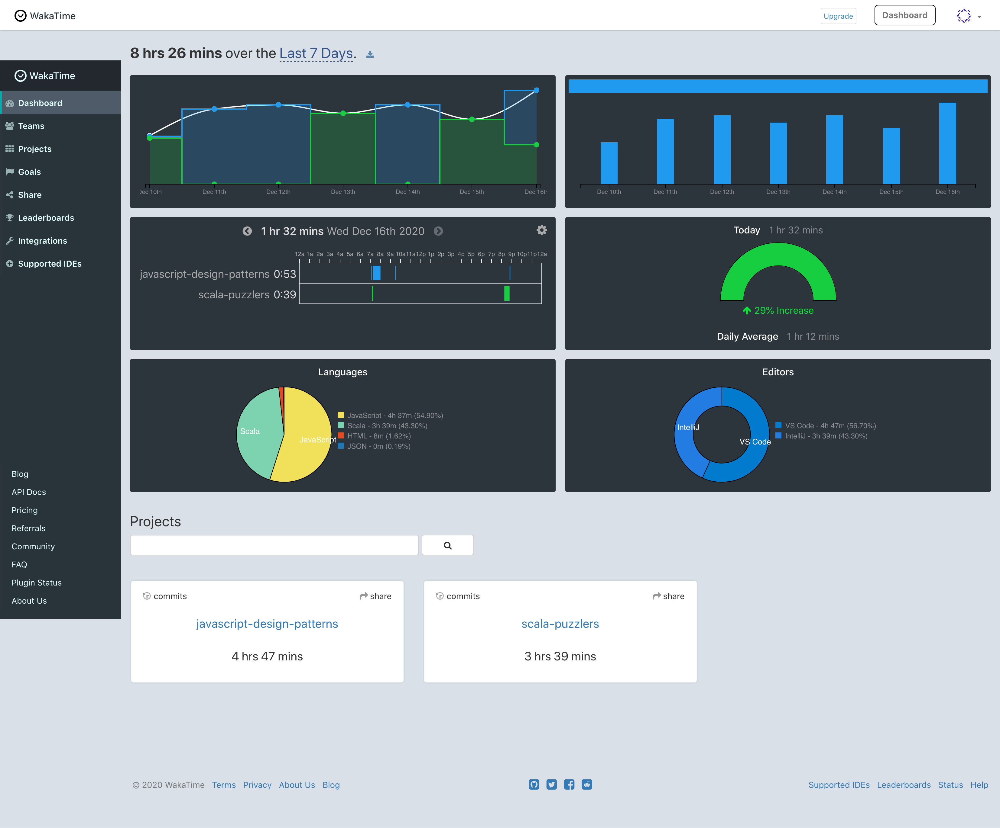

## Day 41: Dec 15, 2020

#### Today's Progress

Learn Scala Puzzles

- Puzzle 12
	- To Map, or Not to Map

#### Thoughts

Be careful not to be taken over the source collection's order automatically when the converting execute on Collection type, especially when let several operations chained.

#### Link to work

- [PR: Learn careful point when converting the order of Collection type](https://github.com/kk0917/scala-puzzlers/pull/15)

#### Statistics - WakaTime

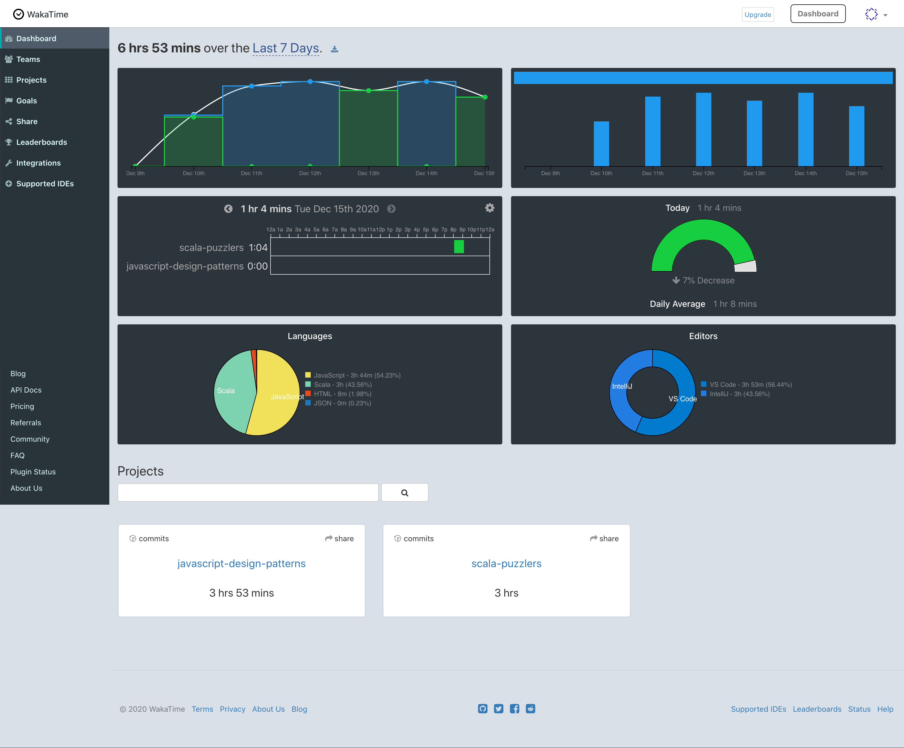

## Day 40: Dec 14, 2020

#### Today's Progress

Learn JavaScript Design Patterns

- Refactor codes
	- Constructor pattern
	- Module pattern

#### Thoughts

There are something you can see by refactoring codes.

#### Link to work

- [PR: refactor: update Constructor pattern](https://github.com/kk0917/javascript-design-patterns/pull/33)
- [PR: refactor: update function literal to arrow formula](https://github.com/kk0917/javascript-design-patterns/pull/34)

#### Statistics - WakaTime

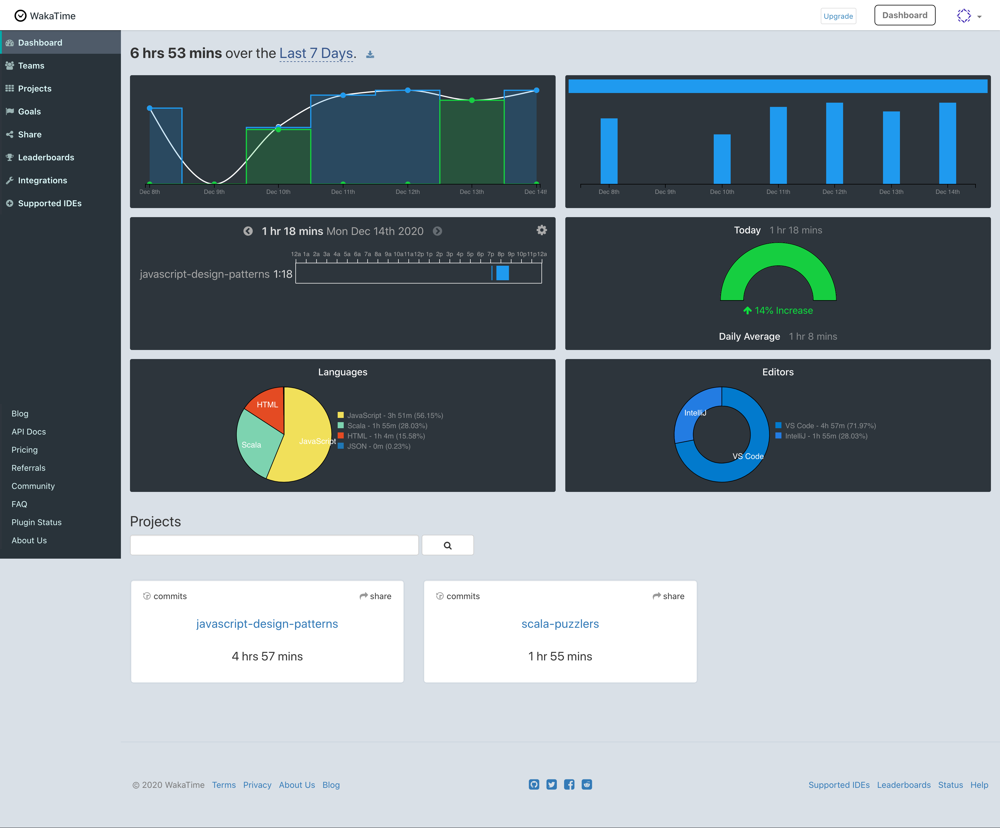

## Day 39: Dec 13, 2020

#### Today's Progress

Learn iteration processing by using Scala's map function.

#### Thoughts

...

#### Link to work

- [PR: scala-puzzlers](https://github.com/kk0917/scala-puzzlers/pull/15)

#### Statistics - WakaTime

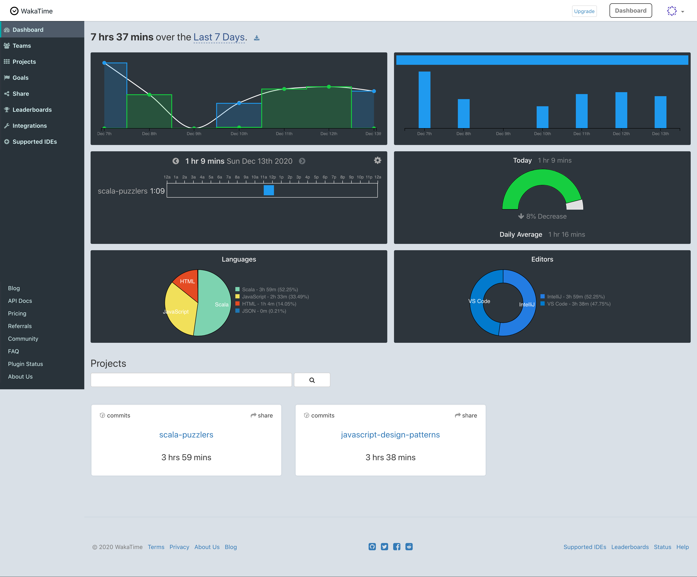

## Day 38: Dec 12, 2020

#### Today's Progress

Review Constructor Design Pattern codes.

#### Thoughts

I deeply learned that pattern.

#### Link to work

- [PR: javascript-design-patterns](https://github.com/kk0917/javascript-design-patterns/pull/32)

#### Statistics - WakaTime

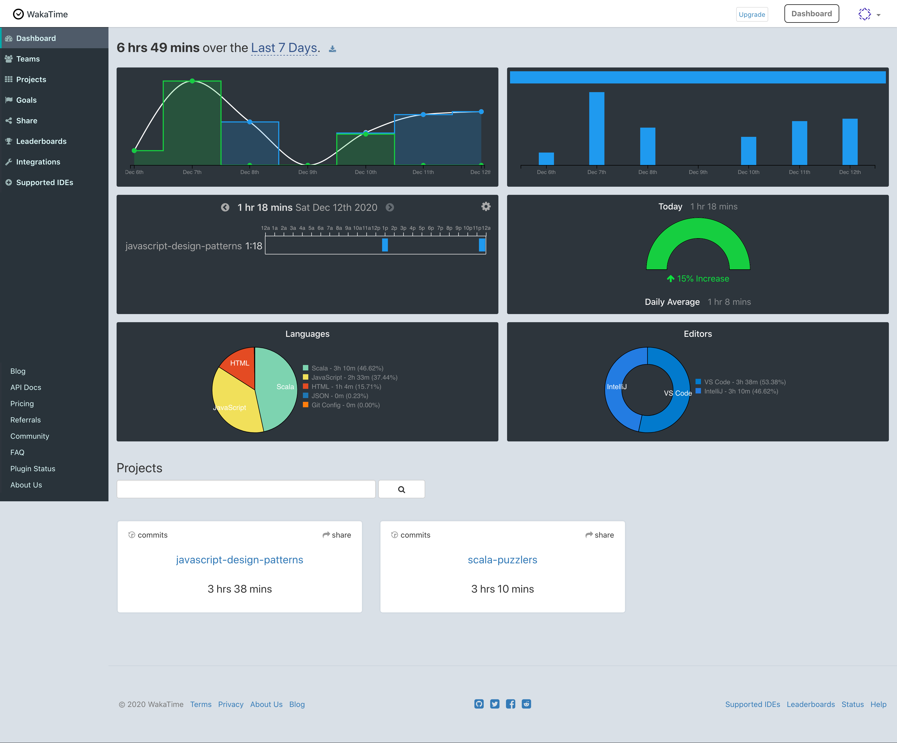

## Day 37: Dec 11, 2020

#### Today's Progress

Learn Prototype Design Pattern.

#### Thoughts

Prototype is familiar with JS codes.

#### Link to work

- [PR: javascript-design-patterns](https://github.com/kk0917/javascript-design-patterns/pull/31)

#### Statistics - WakaTime

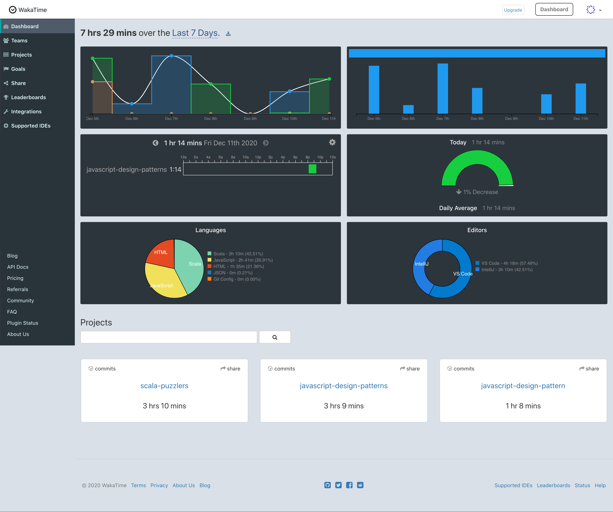

## Day 36: Dec 10, 2020

#### Today's Progress

Learn characteristic of lazy val syntax in Scala language

#### Thoughts

lazy val doesn't only initialize by first access, it initialize again when exceptions are thrown in the middle of initialization.

So, Scala initialize processing every time it access until initialization success. This is an effective choice to the lazy initialization of resource.

#### Link to work

- [Pull Request](https://github.com/kk0917/scala-puzzlers/pull/14)

#### Statistics - WakaTime

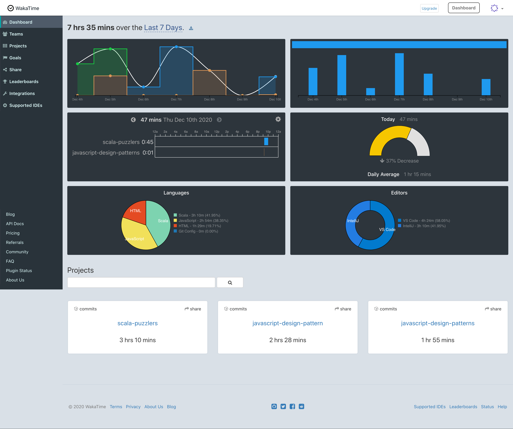

## Day ~~36~~: Dec 9, 2020

#### Today's Progress

None

#### Thoughts

I lost myself. But I cannot be helped, because I'm a human.

"Humans are not over when they lose, humans are over when they give up."

#### Link to work

None

#### Statistics - WakaTime

None

## Day 35: Dec 8, 2020

#### Today's Progress

- Learn Mediator Design pattern

#### Thoughts

Study is easy. Learn is difficult.

#### Link to work

- [PR: Add implementation sample of Mediator Design Pattern](https://github.com/kk0917/javascript-design-patterns/pull/30)

#### Statistics - WakaTime

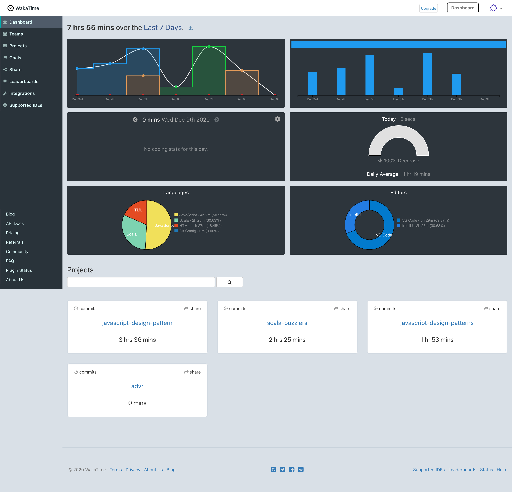

## Day 34: Dec 7, 2020

#### Today's Progress

- Learn Scala case class

#### Thoughts

case class is very useful. it is unneccessery to override equals, hashCode, and toString methods, not to clarify "new" word when instance a class.

#### Link to work

- [PR: Learn how to use case class that have various utility method](https://github.com/kk0917/scala-puzzlers/pull/13)

#### Statistics - WakaTime

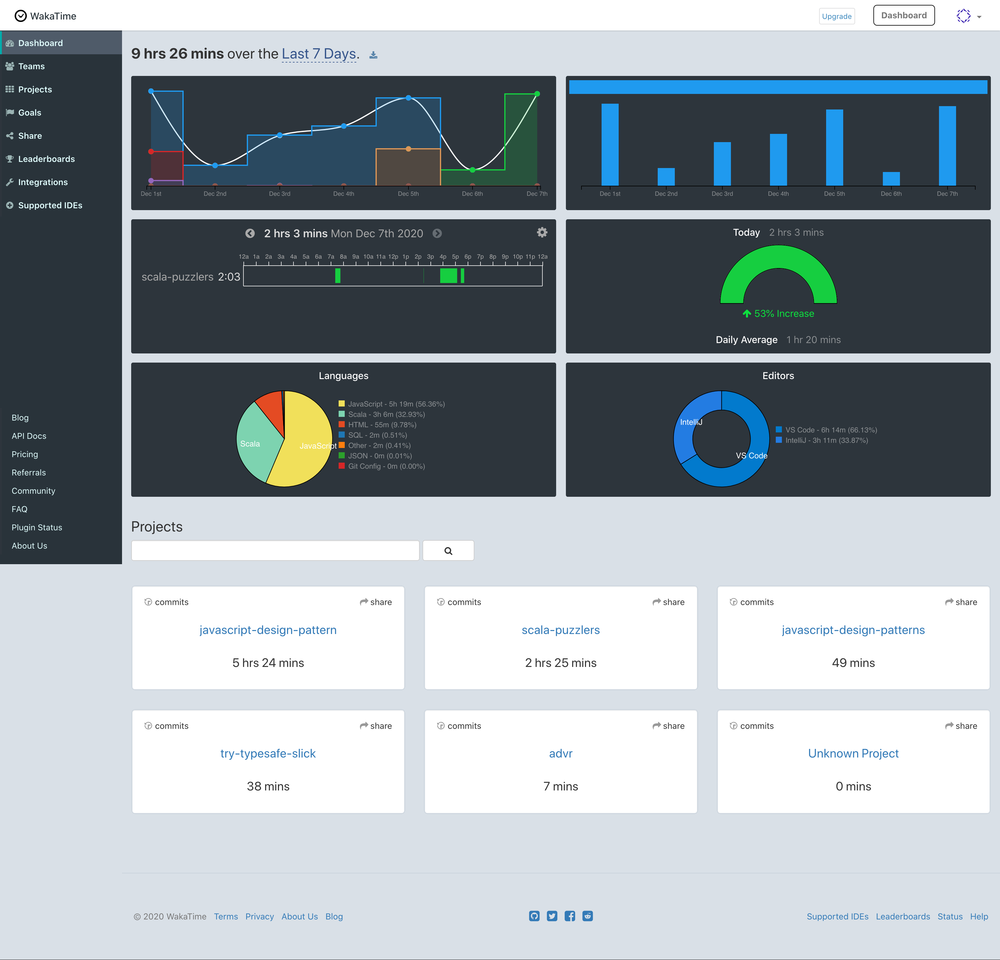

## Day 33: Dec 6, 2020

#### Today's Progress

- Learn Scala case class

#### Thoughts

I learned Scala's case class is light means has various and utility methods.

#### Link to work

- [PR: WIP Learn how to use case class that have various utility method](https://github.com/kk0917/scala-puzzlers/pull/13)

#### Statistics - WakaTime

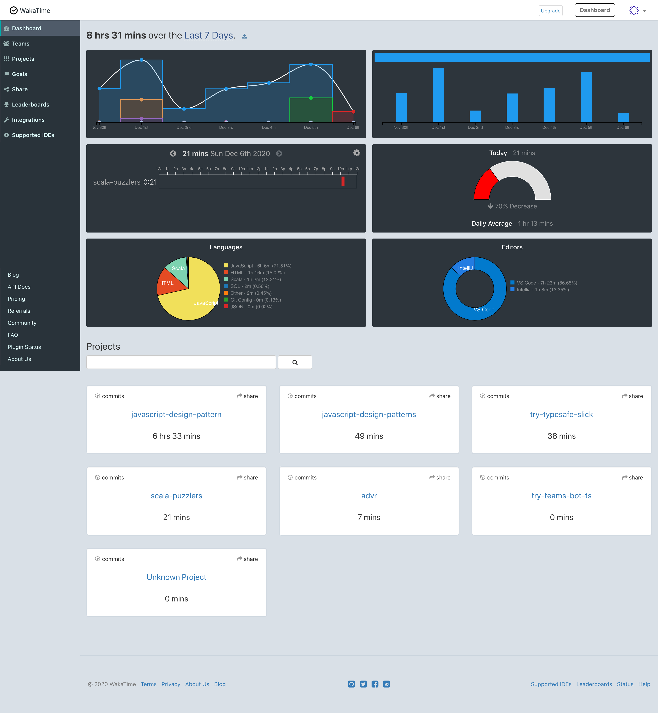

## Day 32: Dec 5, 2020

#### Today's Progress

- Learn Mediator Design Pattern by using implementing sample of JS codes.

#### Thoughts

I've only written JS for the last few days. I wanna write Scala everyday!

#### Link to work

- [PR: WIP Learn Mediator Design Pattern](https://github.com/kk0917/javascript-design-patterns/pull/29)

#### Statistics - WakaTime

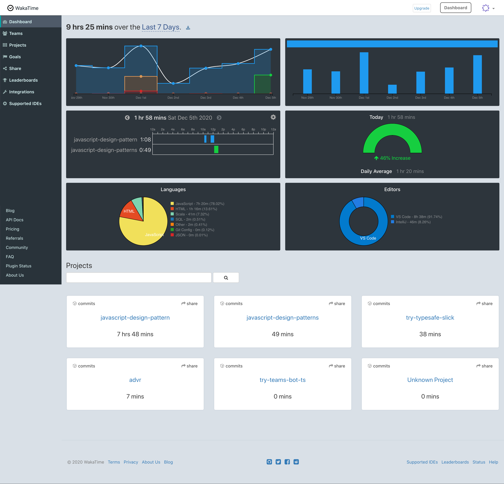

## Day 31: Dec 4, 2020

#### Today's Progress

- Learn Mediator Design Pattern by using implementing sample of JS codes.

#### Thoughts

I've only written JS for the last few days. I wanna write Scala everyday!

#### Link to work

- [Commit: WIP Learn Mediator Design Pattern](https://github.com/kk0917/javascript-design-patterns/commit/dae2af9f787f44f5e5f4c79f18d9e13cf2e1ff3d)

#### Statistics - WakaTime

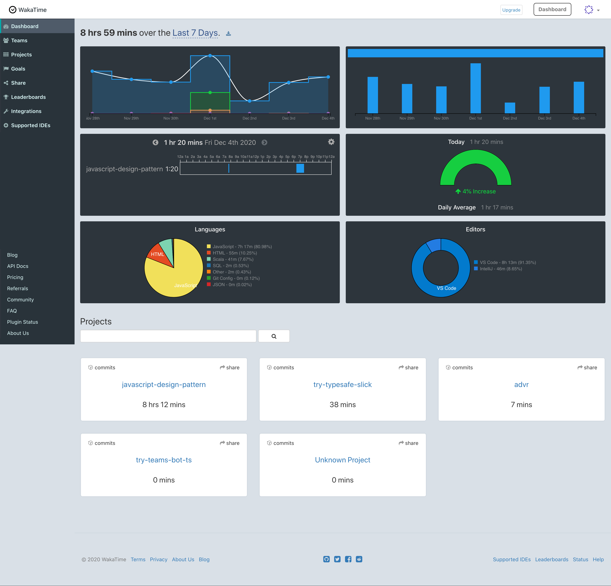

## Day 30: Dec 3, 2020

#### Today's Progress

- Learn Mediator Design Pattern by using implementing sample of JS codes.

#### Thoughts

I can't understand Mediator pattern perfectly yet. I need more learn.

#### Link to work

- [Commit: WIP Learn Mediator Design Pattern](https://github.com/kk0917/javascript-design-patterns/commit/232dd3ff41ced9acf12d74fe5fda18e9ccd7439b)

#### Statistics - WakaTime

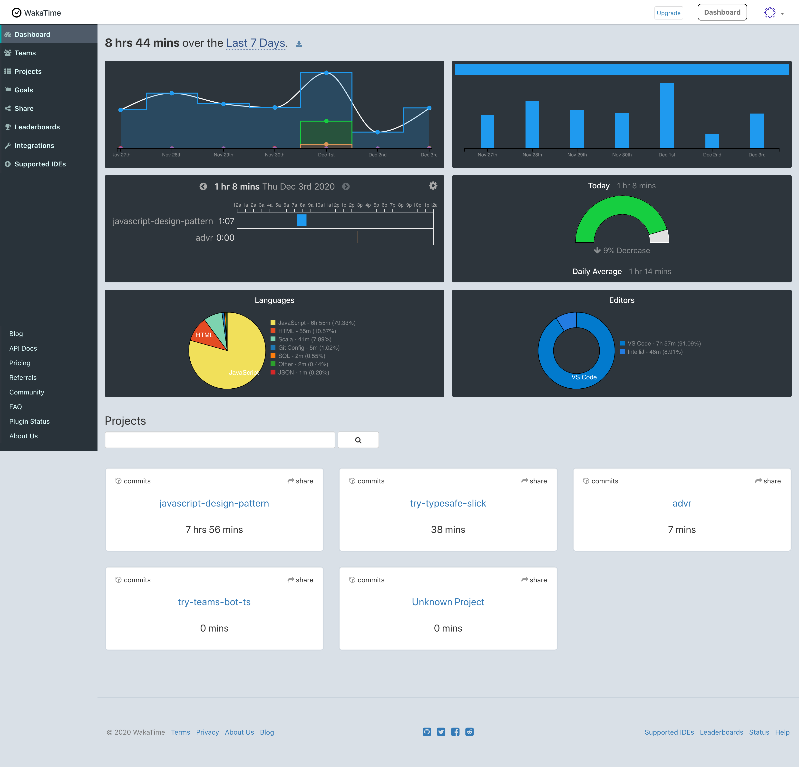

## Day 29: Dec 2, 2020

#### Today's Progress

- Learn Mediator Design Pattern by using JS codes.

#### Thoughts

I can't understand Mediator pattern perfectly yet. I need more learn.

#### Link to work

- [Commit: WIP Learn Mediator Design Pattern](https://github.com/kk0917/javascript-design-patterns/commit/3db486343d56500d962d5fa8f53848391ab31259)

#### Statistics - WakaTime

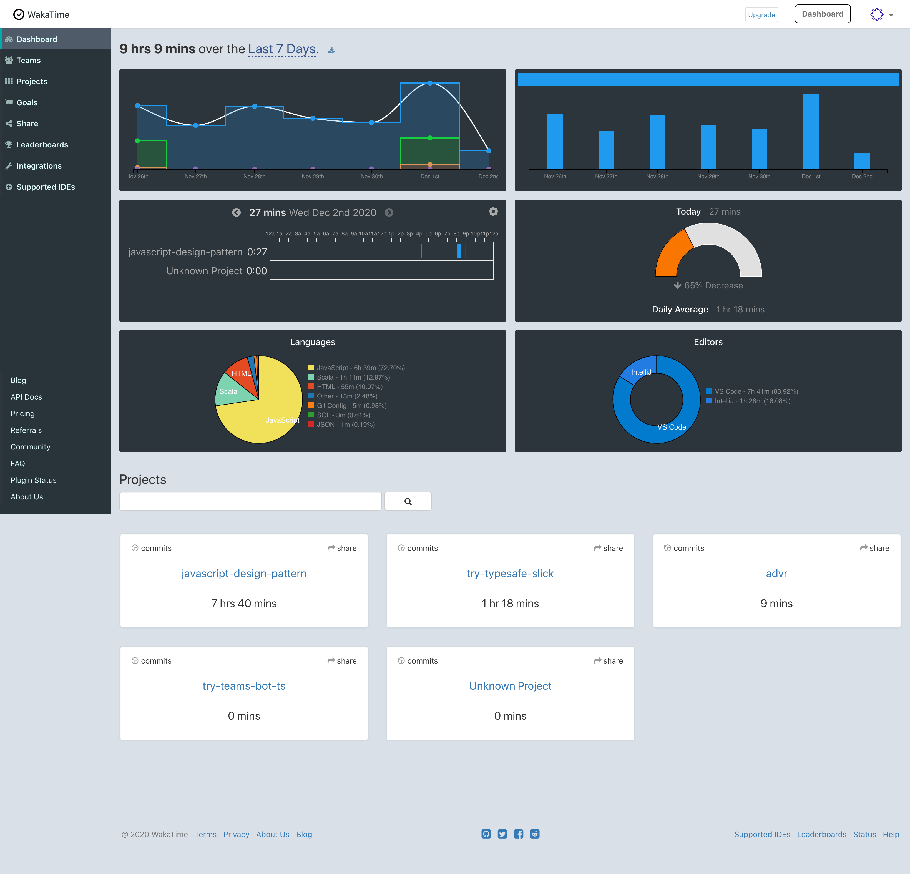

## Day 28: Dec 1, 2020

#### Today's Progress

- Try implementing Pub/Sub example.
- Try how to config Slick's database connection.

#### Thoughts

Slick continues to make no progress.. I google it again and read official reference again, and again..

#### Link to work

- [Repo: kk0917/try-typesafe-slick](https://github.com/kk0917/try-typesafe-slick)
- [Commit: WIP Learn Observer Design Pattern](https://github.com/kk0917/javascript-design-patterns/commit/f2353f72993d6ecaa565ae09db107aa4f15a8fcf)

#### Statistics - WakaTime

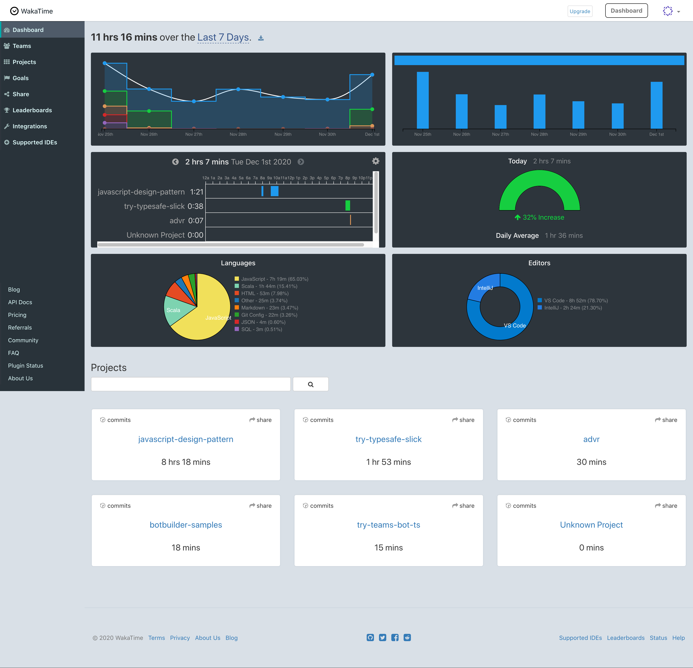

## Day 27: Nov 30, 2020

#### Today's Progress

- Try implement Pub/Sub example.

#### Thoughts

I've tried various implementation samples, so I Deepened my understanding.

#### Link to work

- [Commit: WIP Learn Observer Design Pattern](https://github.com/kk0917/javascript-design-patterns/commit/7e827200e50e2c14614eea26f69464266ab11c7b)

#### Statistics - WakaTime

## Day 26: Nov 29, 2020

#### Today's Progress

- Try implement Pub/Sub example.

#### Thoughts

I realized it's useful by implementing Pub/Sub.

#### Link to work

- [Commit: WIP Learn Observer Design Pattern](https://github.com/kk0917/javascript-design-patterns/commit/6e380f6c6fe16a86a1b8f4d671c386c49b4e4594)

#### Statistics - WakaTime

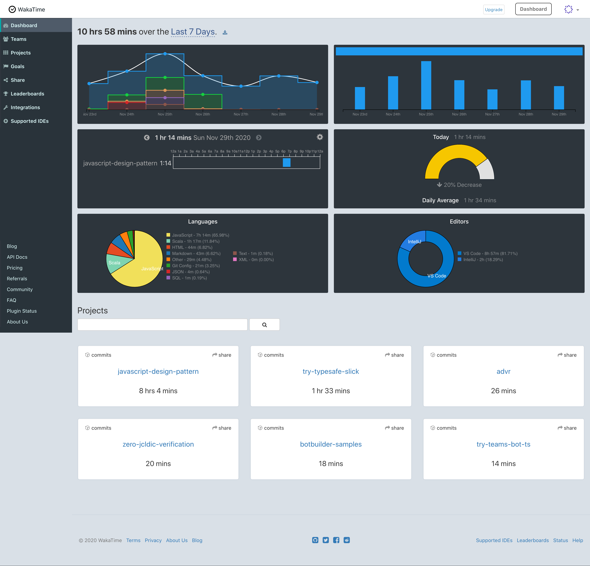

## Day 25: Nov 28, 2020

#### Today's Progress

- Try Pub/Sub implementing and run wheter can execute or not.

#### Thoughts

I understood by implementing to run codes.

#### Link to work

- [Commit: WIP Learn Observer Design Pattern](https://github.com/kk0917/javascript-design-patterns/commit/47ad95e59441202f75df28696672875ed21cf0d5)

#### Statistics - WakaTime

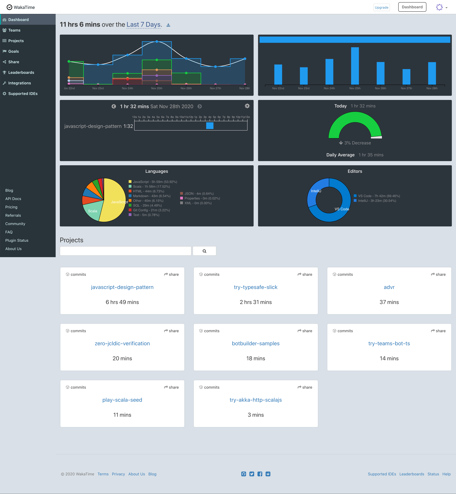

## Day 24: Nov 27, 2020

#### Today's Progress

- Learn Observer Design Pattern with writing JavaScript codes

#### Thoughts

I wrote codes. next is running codes and deepen understandings.

#### Link to work

- [Commit: WIP Learn Observer Design Pattern](https://github.com/kk0917/javascript-design-patterns/commit/52cfa6853c9ca8af7a0f6f15ded4b3ab08e5190b)

#### Statistics - WakaTime

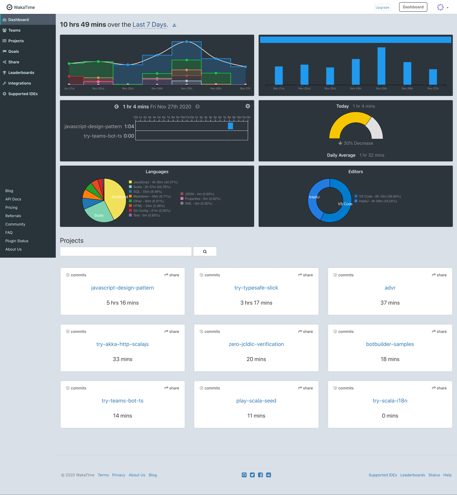

## Day 23: Nov 26, 2020

#### Today's Progress

- Try Slick - Scala ORM Library
- Learn Observer Design Pattern with writing JavaScript codes

#### Thoughts

Trying Slick is no progress..

#### Link to work

- [Repo: kk0917/try-typesafe-slick](https://github.com/kk0917/try-typesafe-slick)
- [Commit: WIP Learn Observer Design Pattern](https://github.com/kk0917/javascript-design-patterns/commit/ba7b568d5fbab71681bf9bb9bb0627279fda11a8)

#### Statistics - WakaTime

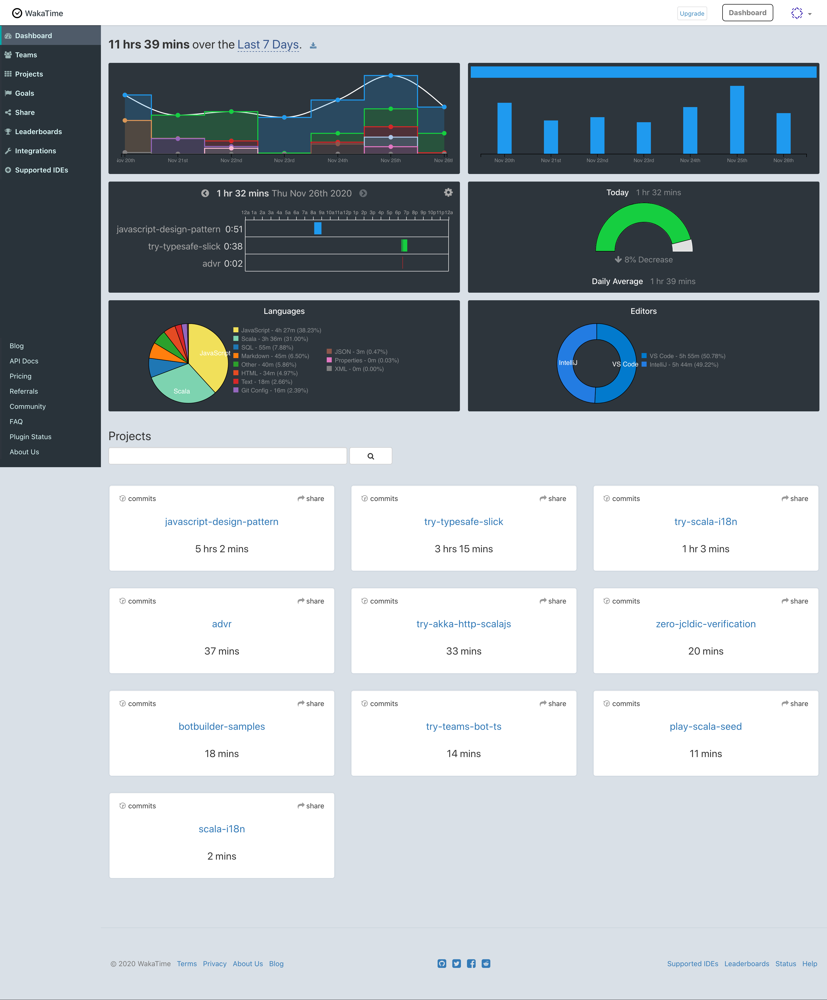

## Day 22: Nov 25, 2020

#### Today's Progress

- Try Slick - Scala ORM Library
- Learn Observer Design pattern with writing JavaScript codes

#### Thoughts

Slick's verification doesn't progress today again... I'd Seen [Docs](https://scala-slick.org/doc/3.3.2/introduction.html) and had tried to understand, so time is up.

#### Link to work

- [Repo: kk0917/try-typesafe-slick](https://github.com/kk0917/try-typesafe-slick)
- [Commit: WIP Learn Observer Design Pattern](https://github.com/kk0917/javascript-design-patterns/commit/ba7b568d5fbab71681bf9bb9bb0627279fda11a8)

#### Statistics - WakaTime

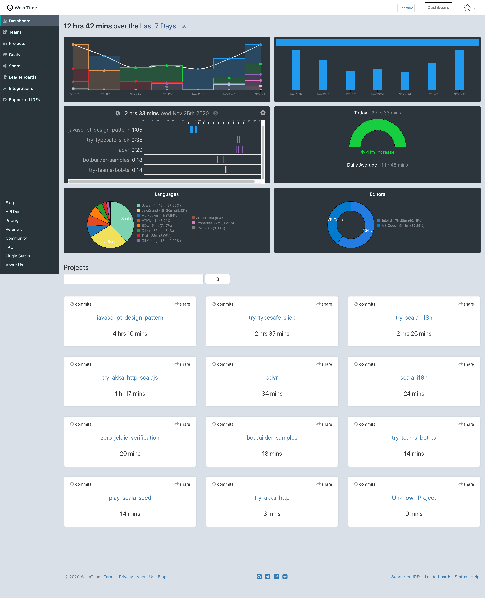

## Day 21: Nov 24, 2020

#### Today's Progress

- Try Slick - Scala ORM Library
- Learn Observer Design pattern with writing JavaScript codes

#### Thoughts

It's difficult for me to understand the Slick Documentation, so the progress has stopped...

#### Link to work

- [Repo: kk0917/try-typesafe-slick](https://github.com/kk0917/try-typesafe-slick)
- [Commit: WIP Learn Observer Design Pattern](https://github.com/kk0917/javascript-design-patterns/commit/7afe358cf8b901075f126ad9fde0c549c06dfe96)

#### Statistics - WakaTime

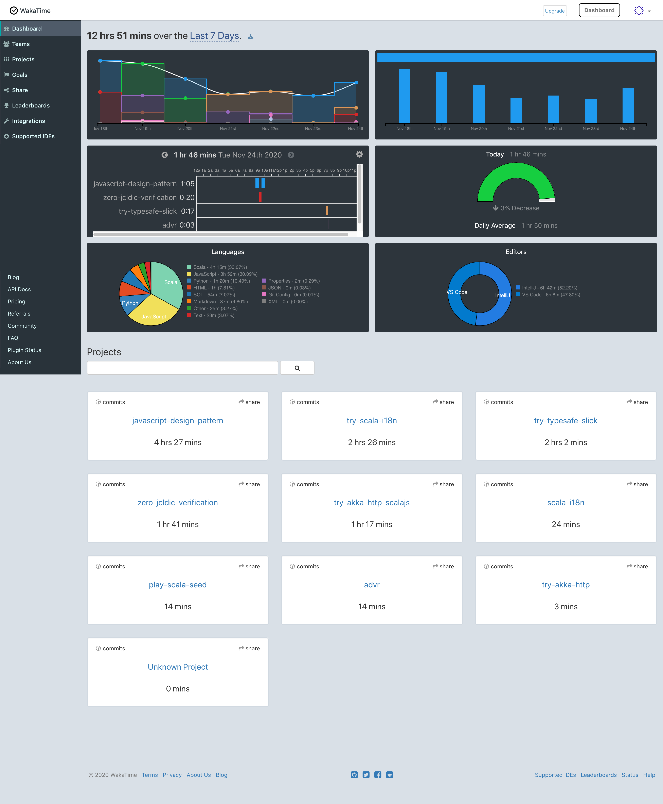

## Day 20: Nov 23, 2020

#### Today's Progress

- WIP: Learn Observer Design pattern

#### Thoughts

There are few time writing JS Codes lately, so I often wrong writihg class and object literarl...

#### Link to work

- [Commit: Learn Observer Design Pattern](https://github.com/kk0917/javascript-design-patterns/commit/6ea2cd5ee5c67d652f1c91fb371ed607cef22ef4)

#### Statistics - WakaTime

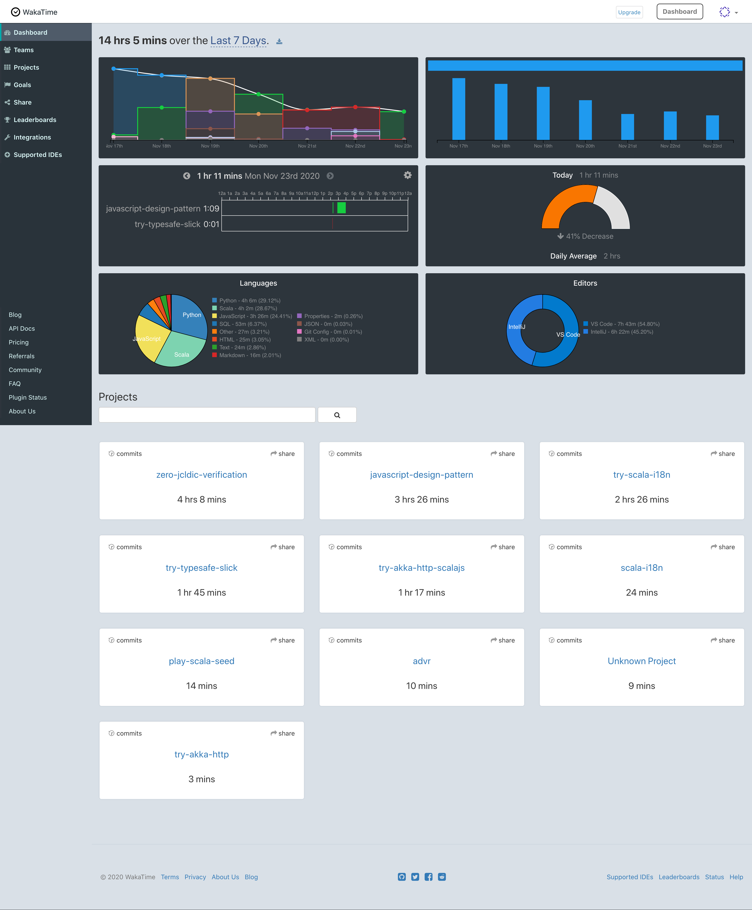

## Day 19: Nov 22, 2020

#### Today's Progress

- Try Slick - Scala ORM Library

#### Thoughts

I can't understand how to use Slick library yet...

#### Link to work

- [Commit: kk0917/try-typesafe-slick](https://github.com/kk0917/try-typesafe-slick/commit/9fcf6af5fd17a2aeafd578ae5e27ff0939cd402d)

#### Statistics - WakaTime

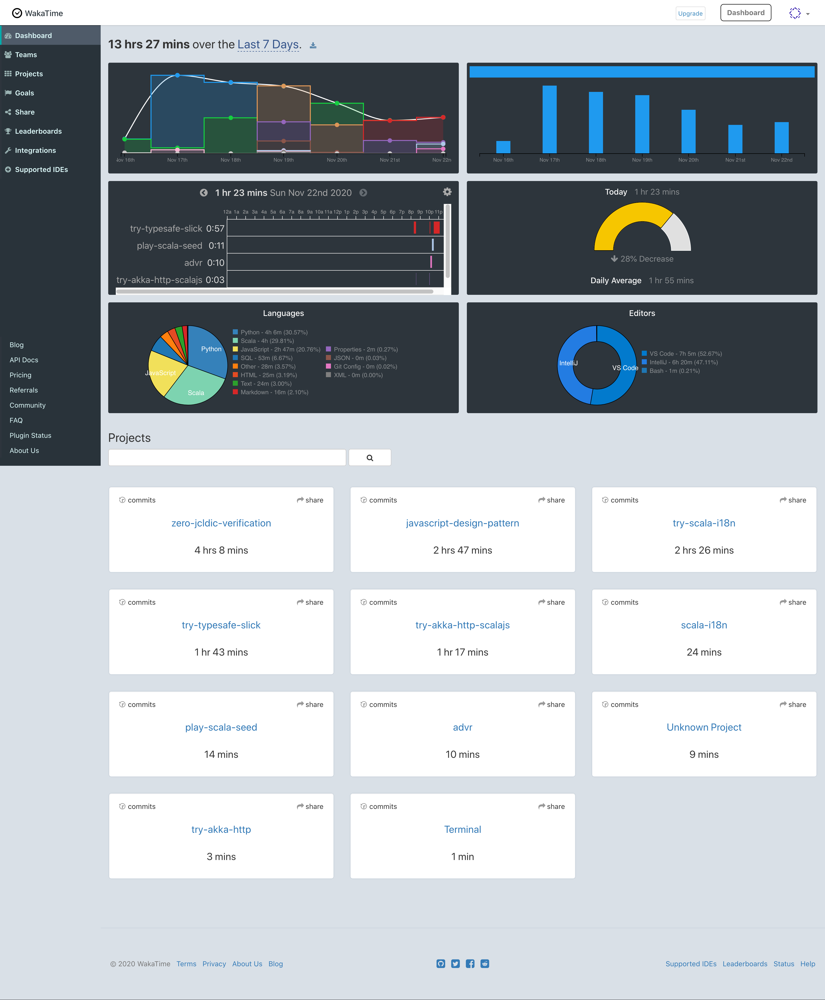

## Day 18: Nov 21, 2020

#### Today's Progress

- Try Slick - Scala ORM Library

#### Thoughts

I wanted to apply Schema and table codes written Slick syntax to databases, but I wasted times to initial settings and local db's error... So, time is over. I'll try again tomorrow. Don't give me up!

#### Link to work

- [Repo: kk0917/try-typesafe-slick](https://github.com/kk0917/try-typesafe-slick)

#### Statistics - WakaTime

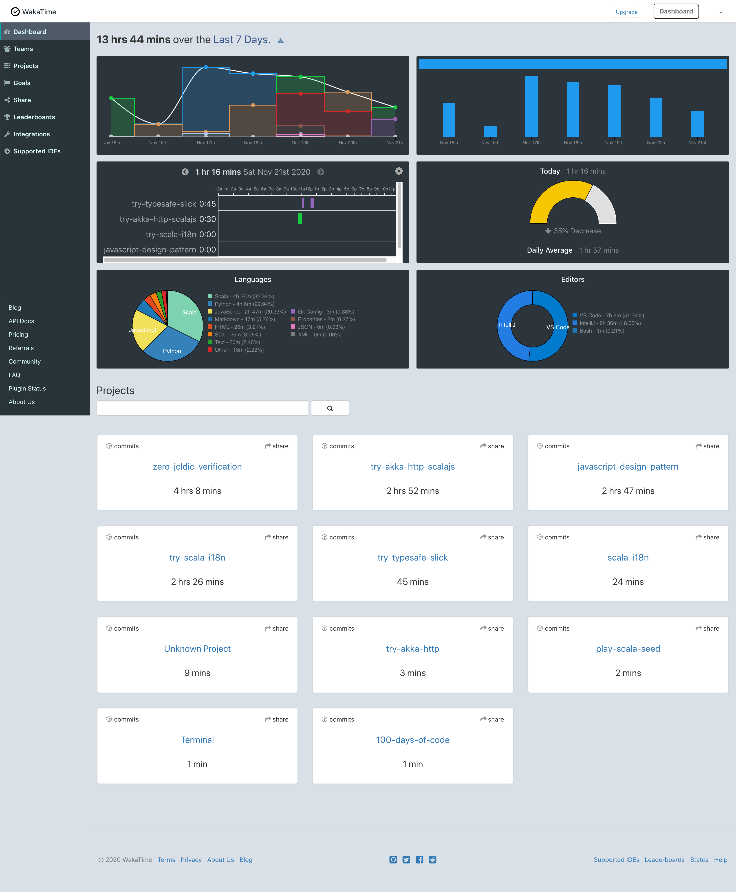

## Day 17: Nov 20, 2020

#### Today's Progress

- Fix scala-i18n error
- Learn Observer Design Pattern

#### Thoughts

WIP. I haven't had enough time since yesterday to Learn. I'll recover on this weekend.

#### Link to work

- [Commit: Learn Observer Design Pattern](https://github.com/kk0917/javascript-design-patterns/commit/3ea1187feac614bebae4aa32d9687f71105c4f9c)

#### Statistics - WakaTime

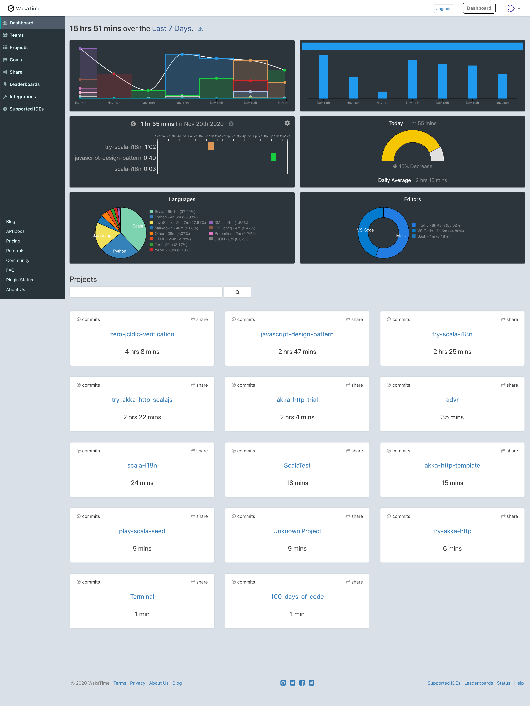

## Day 16: Nov 19, 2020

#### Today's Progress

- Try scala-i18n

#### Thoughts

It's useful. That's all. Thanks [alaz](https://github.com/alaz).

#### Link to work

- [Source Repo: scala-i18n](https://github.com/osinka/scala-i18n)
- [Commit: initial commit](https://github.com/kk0917/try-scala-i18n/commit/44068e715e0aa8063d2a0e7dfe1f04c905d08103)

#### Statistics - WakaTime

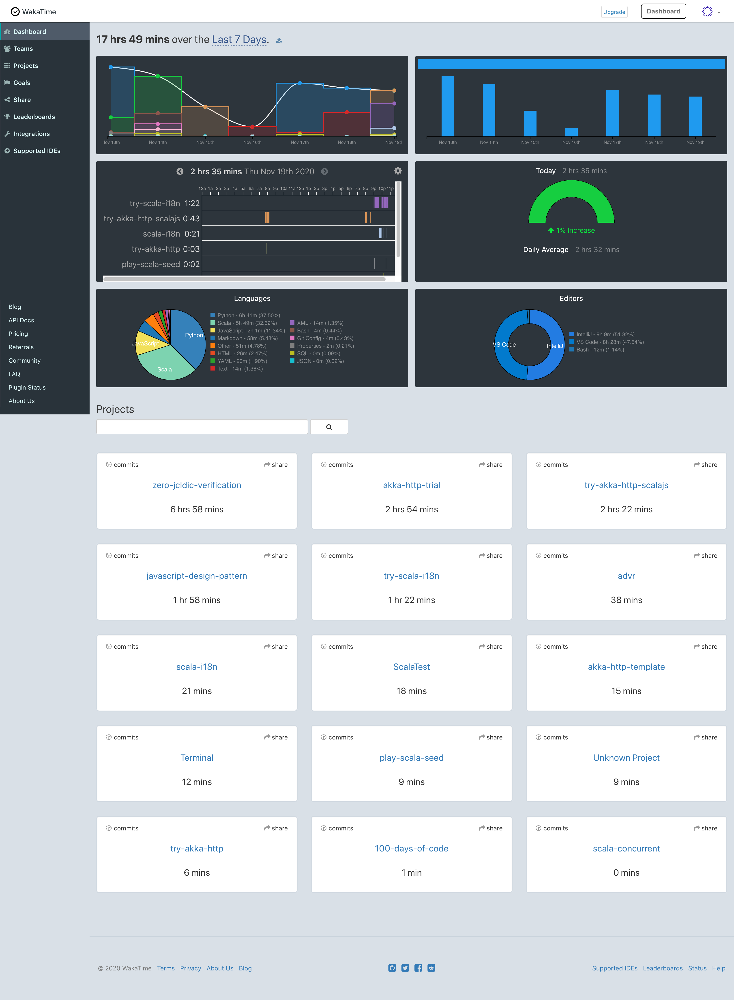

## Day 15: Nov 18, 2020

#### Today's Progress

- Learn Singleton design pattern with writing JS codes.

#### Thoughts

I learned Singleton pattern is to careful being Tightly coupled codes!!

#### Link to work

- [Commit: Learn Singleton pattern](https://github.com/kk0917/javascript-design-patterns/commit/735df07136a7299e00e0d27d054156f1adaffbb3)

#### Statistics - WakaTime

## Day 14: Nov 17, 2020

#### Today's Progress

- Refactoring existing codes.

#### Thoughts

I said "refactoring...", but I do not a big deal. tidied up codes indent, add blank lines between variables and function codes, delete unneccesery comment annexed codes that understands the intention without writing it... 

In short, I refactored codes more readable. It's important and helpful for another person maintains this code in the future to do it. I think The best thing is that it's easy to maintain.

#### Link to work

- [Commit: refactor: refactor existing files for generating dic](https://github.com/kk0917/zero-jcldic-verification/commit/99fd3cd1f5f9b83b175153e3bc462a5683a486fa)

#### Statistics - WakaTime

## Day 13: Nov 16, 2020

#### Today's Progress

- Learn Singleton design pattern into [Learning JavaScript design patterns](https://www.amazon.co.jp/dp/1449331815/ref=cm_sw_r_tw_dp_x_CvMSFb1J3D1GB)

#### Thoughts

I often use singleton object when I write Scala codes. It's a lot of learning to write that design pattern codes at two different angles.

#### Link to work

- [Commit: Learn 2.4 Singleton Pattern](https://github.com/kk0917/javascript-design-patterns/commit/17861c5fcf96c031c7417e842ee4b1934222629c)

#### Statistics - WakaTime

## Day 12: Nov 15, 2020

#### Today's Progress

- I tried Akka HTTP library with Scala.js by using Gitter8 Templates.

#### Thoughts

I understood the project's structure. I'd like to master Scala.jp like Akka.

#### Link to work

- [Repo: try-akka-http-scalajs](https://github.com/kk0917/try-akka-http-scalajs)

#### Statistics - WakaTime

## Day 11: Nov 14, 2020

#### Today's Progress

- Created HTTP Routing implementetion by using Akka HTTP Scala library.

#### Thoughts

Haha! It tooks 3 hours.., slow progress.

I was able to implement it, but I was not able to internal logic of Akka HTTP yet. Anyway, I've deepen my understanding while writing code.

#### Link to work

- [Commit: Create HTTP Routing](https://github.com/kk0917/akka-http-trial/pull/1/commits/0b3f056c590340a44ad64f8b33df271e1789ba18)

#### Statistics - WakaTime

## Day 10: Nov 13, 2020

#### Today's Progress

- Try to create api by using Akka HTTP Scala library.

#### Thoughts

I can only make base template... I'd like to master creating APIs by using Akka HTTP quickly.

#### Link to work

- [Repo: akka-http-trial](https://github.com/kk0917/akka-http-trial)

#### Statistics - WakaTime

## Day 9: Nov 12, 2020

#### Today's Progress

- Learn how to process Scala's Thread safety, yesterday's continuation.
- Update GitHub actions settings of Scala Templates

#### Thoughts

I knew to be used synchronized block into lazy Modifier.

I separated each CI blocks into GitHub Actions settings to several files. Build, lint, test, commitlint. Because when all of them is includes one file, CI processings will stop if one processing fail.

#### Link to work

- [Commit: learn synchronized processing of check and then, long lock.](https://github.com/kk0917/n-school-scala-concurrent/commit/beb6437afa285703155ef609ff0a0b58589eae37)
- [Repo: scala-templates](https://github.com/kk0917/scala-templates)

## Day 8: Nov 11, 2020

#### Today's Progress

Learn how to process Scala's Thread safety.

#### Thoughts

I understood base concept of Thread safe. But What you know is different from what you can use.

#### Link to work

- [Commit: learn how to execute thread processing safety](https://github.com/kk0917/n-school-scala-concurrent/commit/23f52c7230b3376b1613b909bb31b3a9d6cc9315)

## Day 7: Nov 10, 2020

#### Today's Progress

Learn Thread's concept and how to execute Scala's concurrent processing by using java.lang.Thread.

#### Thoughts

"concurrent" is "並行" in Japanese. "Parallel" is "並列" in Japanese. So, I should care to read one sentences these similar words are mixed in.

#### Link to work

- [Commit: chore: learn scala's concurrent processing by using thread](https://github.com/kk0917/n-school-scala-concurrent/commit/9dc01fdab27853991d2fbe8fac42731537905fae)

## Day 6: Nov 9, 2020

#### Today's Progress

Learn Revealing Module Pattern of design patterns with writing codes

#### Thoughts

This design pattern is clear what private functions or propperties is published, readable　by using pointers. I got it.

#### Link to work

- [Commit: learn 2.3 Revealing Module Patterns](https://github.com/kk0917/javascript-design-patterns/commit/3893cbc34afacc8a3672d18fd7d620f82d4fa811)

## Day 5: Nov 8, 2020

#### Today's Progress

Learn module pattern of design patterns with writing codes

#### Thoughts

JavaScript language doesn't have namespace, but it can create module pattern using Immediately-Invoked Functions. It's so difficult for me to understand its concept when I was first year since starting programmer carrear. 

I wanna say "Haha! Don't worry. Your eyes will be used to it".

#### Link to work

- [Commit: javascript-design-patterns](https://github.com/kk0917/javascript-design-patterns/pull/9)

## Day 4: Nov 7, 2020

#### Today's Progress

Create my "Scala Project Template". With a tool called Giter8
You can generate the directory structure, definition file, etc. when starting a Scala language project with sbt. This template is packed with various useful tools. Unit test tool, test coverage tool, testing framework, code formatter, code style checker, and GitHub Actions CI workflow.

#### Thoughts

TO introduce One tool of them is easy, but it's very annoying and boring to introduce all of them at once.

I of the future will thank me of today...(Is this sentence correct?)

#### Link to work

- [GitHub Repository: scala-templates](https://github.com/kk0917/scala-templates)

## Day 3: Nov 6, 2020

#### Today's Progress

- Replace Rest API cloud functions codes
	- To prepare adding another functions
- Create Scraping cloud functions codes
	- Scrape zip file number from a target site, request HTTP POST with zip file number into request body, and fetch zip files.

#### Thoughts

It was first time to create the scraping programming. Scraping looks like E2E test automation tools. Selenium, Cypress etc. Both are sober and steady work, but it's important things to work Sincerely.

By the way, coding 100 days challenge is too short for my programming life. So, I changed 1000 days challenge.

#### Link to work

My Repository: [kk0917/google-cloud-functions-sample](https://github.com/kk0917/google-cloud-functions-sample)

- API-related
	- [commit=feat: replace rest api function ](https://github.com/kk0917/google-cloud-functions-sample/commit/89283dac246ca24be19739e666c9b4c9bd14dc46)
	- [commit=chore: add docstrings ](https://github.com/kk0917/google-cloud-functions-sample/commit/f0185a0a7f06e344c244674b337cecbb11ace2e3)
- Scraping-related
	- [commit=feat: create scraping function](https://github.com/kk0917/google-cloud-functions-sample/commit/e482152bbfff96006e86ae0422b429fbc755de06)

## Day 2: Nov 5, 2020

#### Today's Progress

Play Play Framework

#### Thoughts

I'd touched programming language framework after a long time. It was fun to touch the mature framework and touch its architecture and ideas for the first time in a while.

#### Link to work

- [commits: kk0917/scala-playframework2](https://github.com/kk0917/scala-playframework2/commit/26ae08be8e9d8ca4b1528dfadc2d0fb5073f3311)

## Day 1: Nov 4, 2020

#### Today's Progress

Learn to create parser

#### Thoughts

It was so difficult for me to understand various parser. Read text, write sample code, Read text..., I'm unconfident using today's learning as my programming skills.
Anyways, I should remember it with my body if I can't remember it with my head.

Writes As many as one line, one character everyday.

#### Link to work

- [commits: kk0917/scala-parser-combinator](https://github.com/kk0917/scala-parser-combinator/pull/7/commits/791a3c730fe75ddca8745d761232dae36e3eab51)

## Day 0: August 20, 2020

#### Today's Progress

Learn create Scala's animation, GUI

#### Thoughts

The first day of [Write Code Everyday](https://johnresig.com/blog/write-code-every-day/).
I tweet my progress it on every weekend. ([#WriteCodeEveryday](https://twitter.com/search?q=%23WriteCodeEveryday&src=typed_query))

I've definitely done #WriteCodeEveryday. So, my spirit and humanity will grow by having this experiences. 

I give this word by Richard M Nixon to myself a year later.

> "Human is not finished when That person is defeated. That person is finished when That person quits."
> 

#### Link to work

- [kk0917/n-school-scala-animation](https://github.com/kk0917/n-school-scala-animation)
- [kk0917/n-school-scala-gui](https://github.com/kk0917/n-school-scala-gui)

--
--
Templates:

### Day 0: February 30, 2016 (Example 1)
##### (delete me or comment me out)

**Today's Progress**: Fixed CSS, worked on canvas functionality for the app.

**Thoughts:** I really struggled with CSS, but, overall, I feel like I am slowly getting better at it. Canvas is still new for me, but I managed to figure out some basic functionality.

**Link to work:** [Calculator App](http://www.example.com)

### Day 0: February 30, 2016 (Example 2)
##### (delete me or comment me out)

**Today's Progress**: Fixed CSS, worked on canvas functionality for the app.

**Thoughts**: I really struggled with CSS, but, overall, I feel like I am slowly getting better at it. Canvas is still new for me, but I managed to figure out some basic functionality.

**Link(s) to work**: [Calculator App](http://www.example.com)

### Day 1: June 27, Monday

**Today's Progress**: I've gone through many exercises on FreeCodeCamp.

**Thoughts** I've recently started coding, and it's a great feeling when I finally solve an algorithm challenge after a lot of attempts and hours spent.

**Link(s) to work**
1. [Find the Longest Word in a String](https://www.freecodecamp.com/challenges/find-the-longest-word-in-a-string)
2. [Title Case a Sentence](https://www.freecodecamp.com/challenges/title-case-a-sentence)
